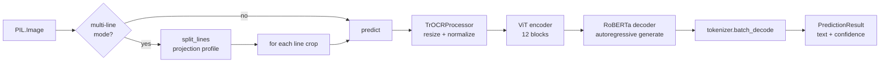
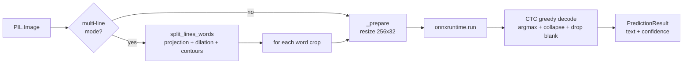
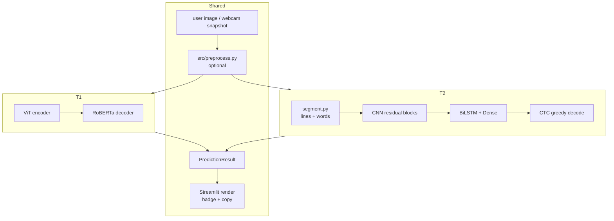

# Logical maps — both recognizer backends

The app supports two recognizers behind the same `PredictionResult` interface.
Pick between them in the Streamlit sidebar. This file diagrams what each one
actually does at inference time.

---

## 1. TrOCR (`microsoft/trocr-base-handwritten`)

**Role:** line-level, pretrained, zero training required, heavyweight (~1.4 GB).
Best on paragraphs, multi-word photos, webcam shots.

### Inference route



### Pipeline stages

```
PIL.Image (any size, RGB)
   |
   | (optional) src/preprocess.py
   |   perspective -> deskew -> denoise -> CLAHE -> binarize
   v
_is_blank() guard                        -> short-circuit empty images
   |
   v
TrOCRProcessor
   |   resize to 384x384
   |   normalize with ImageNet stats
   |   return pixel_values (1, 3, 384, 384)
   v
VisionEncoderDecoderModel.generate
   |   encoder: ViT-base (12 layers, 768 dim)
   |       - patch embed 16x16
   |       - 576 patch tokens -> hidden states
   |   decoder: RoBERTa-base (12 layers, 768 dim)
   |       - cross-attention over encoder states
   |       - autoregressive token generation
   |       - max_new_tokens=64
   |   return_dict_in_generate=True, output_scores=True
   v
processor.batch_decode(skip_special_tokens=True)
   |
   v
_mean_token_probability(scores, sequences)
   |   softmax each step -> pick chosen token's prob -> mean
   v
PredictionResult(text, confidence, line_results=[])
```

### Strengths / weaknesses

| | |
|---|---|
| Model params | ~334M |
| Disk footprint | ~1.4 GB (HF cache) |
| CPU inference | 1-3 s per call |
| Training required | none (pretrained by Microsoft) |
| Input unit | full line (ideal), single word (OK) |
| Multi-line | via projection-profile line split, each run separately |
| Key dep | `torch`, `transformers`, `sentencepiece` |

---

## 2. mltu CRNN (`models/mltu/model.onnx`)

**Role:** word-level, trained locally on IAM_Words, tiny (~10 MB), fast, ONNX-only
at runtime. Best for quick scanning and when TrOCR's size is unacceptable.

### Inference route



### Pipeline stages

```
PIL.Image
   |
   | (optional) src/preprocess.py
   v
(if multiline)  src/segment.py
   split_lines  -> Otsu + horizontal projection profile  -> list[line]
   split_words  -> Otsu + horizontal dilate 15x5 + contours -> list[word]
   |
   v
_prepare(image)
   |   RGB convert, cv2.resize -> (32, 256, 3) float32
   v
onnxruntime.InferenceSession.run
   |   model.onnx (exported from Keras CRNN)
   |   input "input"  : (B, 32, 256, 3)
   |   output "output": (B, 64, vocab+1) softmax logits
   v
CTC greedy decode (pure numpy)
   |   best = argmax over class axis           -> (B, 64)
   |   best_probs = max prob per timestep      -> (B, 64)
   |   for t in range(T):
   |       if idx != prev and idx != blank_index:
   |           emit vocab[idx], record prob
   |       prev = idx
   |
   v
Per-word PredictionResult
   |
   | (multiline) aggregate:
   |   join words with " " -> line text
   |   join lines with "\n" -> final text
   |   confidence = mean of line confidences
   v
PredictionResult(text, confidence, line_results)
```

### Trained model internals (what's inside `model.onnx`)

```
Input (32, 256, 3)
  |
  | Lambda /255
  v
residual_block(16)      -> (32, 256, 16)
residual_block(16)      -> (32, 256, 16)
residual_block(32, s=2) -> (16, 128, 32)
residual_block(32)      -> (16, 128, 32)
residual_block(64, s=2) -> (8,  64,  64)
residual_block(64)      -> (8,  64,  64)
  |
  | Transpose (H, W, C) -> (W, H, C)
  | Reshape  -> (64, 512)        # T=64 timesteps, 8*64=512 feats
  v
BiLSTM(128) return_sequences    -> (64, 256)
Dropout(0.25)
  |
  v
Dense(vocab+1, softmax)          -> (64, 80)    # 79 chars + CTC blank
```

### Strengths / weaknesses

| | |
|---|---|
| Model params | ~1.5M |
| Disk footprint | ~10 MB (.onnx) |
| CPU inference | ~20 ms per word |
| Training required | yes, ~hours on CPU (IAM_Words) |
| Input unit | single word crop (fixed 256x32) |
| Multi-line | requires `src/segment.py` pipeline |
| Key dep | `onnxruntime`, `pyyaml`, `opencv-python` |

---

## 3. Side-by-side comparison



### When to pick which

| Scenario | Pick |
|---|---|
| Paragraph photo, webcam | **TrOCR** |
| Tilted / crowded / messy handwriting | **TrOCR** (more robust) |
| Single word flashcards | **mltu CRNN** (faster, in-distribution) |
| IAM_Words benchmark / word-level accuracy | **mltu CRNN** |
| Embedded / offline / no 1.4 GB download | **mltu CRNN** |
| No time to train | **TrOCR** |

### Shared abstractions

- Both return the same `PredictionResult(text, confidence, line_results)` dataclass
  from `src/recognizer.py`
- Both expose `predict(image)` and `predict_lines(image)` methods
- Both are loaded via `app/streamlit_app.py::get_recognizer(choice)` factory with
  separate `@st.cache_resource` caches so switching in the UI is cheap
- Both benefit from the same `src/preprocess.py` options (deskew, denoise, CLAHE,
  perspective, binarize) because preprocessing happens before either backend runs
