# mltu CRNN — Training & Inference Route

Quick-view map of everything that happens from the IAM dataset to a running
ONNX model inside the Streamlit app.

## End-to-end flow

```mermaid
flowchart LR
    A[data/IAM_Words/words.txt] --> B[load_samples<br/>filter status=ok]
    B --> C[DataProvider<br/>90/10 split]
    C --> D[UnicodeImageReader<br/>np.fromfile + imdecode]
    D --> E[ImageResizer<br/>256 x 32]
    E --> F[LabelIndexer<br/>char -> int]
    F --> G[LabelPadding<br/>len 21, pad=blank]
    G --> H[CRNN model<br/>fit 10 epochs]
    H --> I[CTCloss + CER/WER]
    H --> J[ModelCheckpoint<br/>best val_CER -> model.h5]
    J --> K[Model2onnx<br/>-> model.onnx]
    K --> L[models/mltu/model.onnx<br/>+ configs.yaml]
    L --> M[MltuRecognizer<br/>onnxruntime]
    M --> N[Streamlit app<br/>sidebar: mltu CRNN]
```



## Model architecture (CRNN + CTC)

```
Input  (H=32, W=256, C=3)        RGB image, resized to fixed size
   |
   | Lambda /255.0               normalize to [0, 1]
   v
+-------------------------+
|  residual_block(16)     |      Conv 3x3 -> BN -> ReLU -> Conv 3x3 -> BN + shortcut
|  residual_block(16)     |
|  residual_block(32, s=2)|      stride 2  => H 32->16, W 256->128
|  residual_block(32)     |
|  residual_block(64, s=2)|      stride 2  => H 16->8,  W 128->64
|  residual_block(64)     |
+-------------------------+
   |
   | Transpose (B, H, W, C) -> (B, W, H, C)
   | Reshape  (B, W=64, H*C=8*64=512)
   v
+------------------------------+
|  Bidirectional LSTM(128)     |  returns sequences, 64 timesteps
|  Dropout(0.25)               |
+------------------------------+
   |
   v
+-----------------------------------+
| Dense(vocab_size + 1, softmax)    |  +1 = CTC blank
+-----------------------------------+
   |
   v
CTC logits  (B, T=64, C=vocab+1)
   |
   +--> CTCloss (training)
   +--> model.onnx (exported, inference)
```

**Key numbers**
- Input size: `32 x 256 x 3`
- CNN stride ratio: `1/4` in both axes -> feature map `8 x 64 x 64`
- Timesteps after reshape: `T = 64` (must be >= 2 * max_label - 1 = 41)
- Vocab: 79 characters from IAM labels + 1 CTC blank
- Loss: CTC (`mltu.tensorflow.losses.CTCloss`)
- Metrics: `CERMetric`, `WERMetric`

## Inference path (no TensorFlow)

```
PIL.Image or webcam snapshot
        |
        v
(optional) src/preprocess.py         deskew / denoise / CLAHE / ...
        |
        v
(optional) src/segment.py            split_lines_words -> list[list[word_crop]]
        |
        v
src/mltu_recognizer.MltuRecognizer
        |  resize -> 256x32 float32
        v
onnxruntime.InferenceSession.run    -> logits (T, vocab+1)
        |
        v
CTC greedy decode (numpy)           argmax + collapse repeats + drop blank
        |
        v
PredictionResult(text, confidence, line_results)
        |
        v
app/streamlit_app.py                render with copy button + badge
```

## Files involved

| Stage | File |
|---|---|
| Dataset parsing | `training/train_mltu.py` :: `load_samples` |
| Unicode-safe image IO | `training/train_mltu.py` :: `UnicodeImageReader` |
| Model definition | `training/train_mltu.py` :: `residual_block`, `build_model` |
| Keras Sequence adapter | `training/train_mltu.py` :: `KerasSequenceProvider` |
| Training loop | `training/train_mltu.py` :: `main` |
| ONNX export | mltu `Model2onnx` callback |
| Config file | `models/mltu/configs.yaml` (vocab, height, width) |
| Weights | `models/mltu/model.onnx` |
| Inference wrapper | `src/mltu_recognizer.py` |
| Line/word split | `src/segment.py` |
| UI | `app/streamlit_app.py` (sidebar model selector) |
